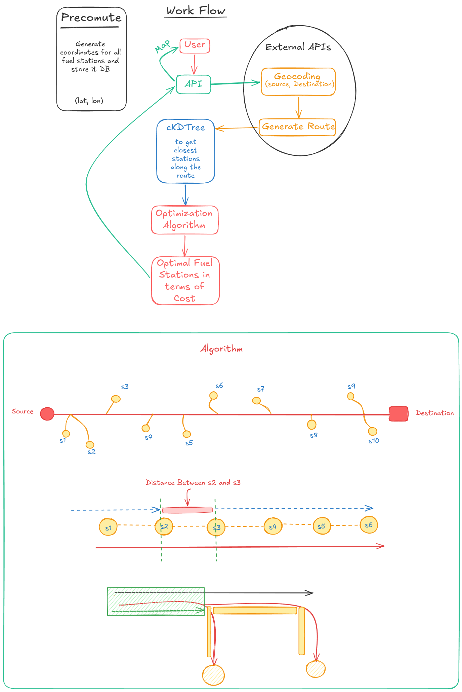

🚛 Fuel Optimizer

Fuel Optimizer is a Django-based web application that computes the most cost-effective fuel stops for long-distance truck routes. Given a source and destination, it generates the driving route, identifies nearby fuel stations using spatial indexing, and applies a Dynamic Programming algorithm to minimize the total fuel cost.

✨ Features
Generate driving routes using OpenRouteService.
Find fuel stations located near the route.
Fast nearest-station lookup using SciPy cKDTree.
Optimize fuel stops based on fuel prices, tank capacity, and vehicle mileage.
Interactive route visualization with Leaflet.js and OpenStreetMap.

🛠️ Tech Stack
Backend: Django, Django REST Framework
Database: PostgreSQL
Frontend: HTML, CSS, JavaScript, Leaflet.js
APIs: OpenRouteService, OpenStreetMap
Algorithms: Dynamic Programming, cKDTree (Spatial Indexing)

🚀 How It Works
Geocode the source and destination.
Generate the driving route.
Find fuel stations near the route using a cKDTree.
Sort stations by their position along the route.
Use Dynamic Programming to determine the minimum-cost sequence of fuel stops.
Display the optimized route and fuel stations on an interactive map.

