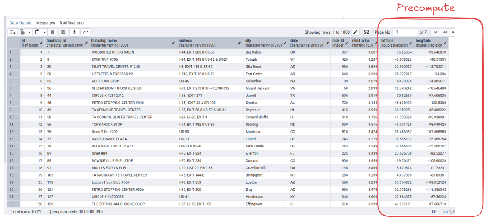

🚛 Fuel Optimizer

Fuel Optimizer is a Django-based web application that computes the most cost-effective fuel stops for long-distance truck routes. Given a source and destination, it generates the driving route, identifies nearby fuel stations using spatial indexing, and applies a Dynamic Programming algorithm to minimize the total fuel cost.

✨ Features
Generate driving routes using OpenRouteService.
Find fuel stations located near the route.
Fast nearest-station lookup using SciPy cKDTree.
Optimize fuel stops based on fuel prices, tank capacity, and vehicle mileage.
Interactive route visualization with Leaflet.js and OpenStreetMap.

🛠️ Tech Stack
Backend: Django, Django REST Framework
Database: PostgreSQL
Frontend: HTML, CSS, JavaScript, Leaflet.js
APIs: OpenRouteService, OpenStreetMap
Algorithms: Dynamic Programming, cKDTree (Spatial Indexing)

🚀 How It Works
Geocode the source and destination.
Generate the driving route.
Find fuel stations near the route using a cKDTree.
Sort stations by their position along the route.
Use Dynamic Programming to determine the minimum-cost sequence of fuel stops.
Display the optimized route and fuel stations on an interactive map.

# Fuel Optimizer

## Requirements

- Python 3.12+ (or the version used by the project)
- PostgreSQL
- Git

## 1. Clone the repository

```bash
git clone <repository-url>
cd FuelOptimizer-main
```

## 2. Create a virtual environment

```bash
python3 -m venv .venv
```

## 3. Activate the virtual environment

### Linux/macOS

```bash
source .venv/bin/activate
```

### Windows

```cmd
.venv\Scripts\activate
```

## 4. Install dependencies

```bash
pip install -r requirements.txt
```

## 5. Create a PostgreSQL database

Create a database, for example:

```sql
CREATE DATABASE fueloptimizer;
```

## 6. Configure environment variables

Create a `.env` file:

```env
DB_NAME=fueloptimizer
DB_USER=postgres
DB_PASSWORD=your_password
DB_HOST=localhost
DB_PORT=5432
SECRET_KEY=your_secret_key
DEBUG=True
```

Update `settings.py` to use these values if it doesn't already.

## 7. Apply migrations

```bash
python manage.py migrate
```

## 8. Import fuel station data

Place the CSV file in the `data/` directory and run:

```bash
python manage.py import_station_data data/fuel_stations.csv
```

## 9. Create an admin user

```bash
python manage.py createsuperuser
```

## 10. Run the development server

```bash
python manage.py runserver
```

Open:

```
http://127.0.0.1:8000/
```

```



